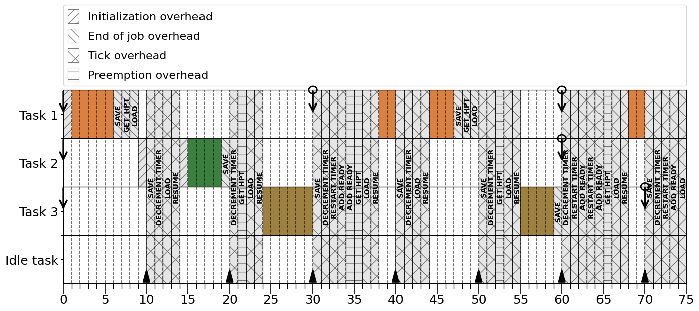
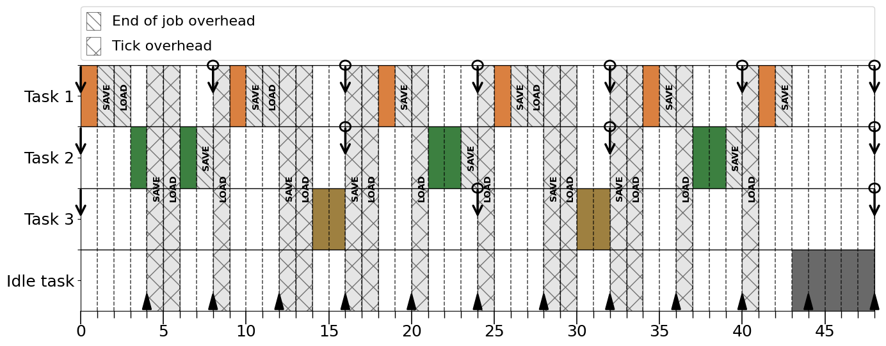

# Overhead-Aware Python Real-Time Simulator

This repository contains a Python simulator for scheduling periodic real-time tasks in a uniprocessor tick-driven context, taking into account the overheads related to scheduling and tick interrupting. The simulator is designed to provide a realistic representation of task scheduling scenarios, allowing users to find the simulation interval and display the schedule of a given task set with different overhead values.



## Features

- **Tick-Driven Context:** The simulator operates in a tick-driven context, where tasks are scheduled at regular intervals based on the system's tick rate.

- **Periodic Real-Time Tasks:** The simulator supports the scheduling of periodic real-time tasks, which have specific timing requirements and deadlines to meet.

- **Overhead Modeling:** The simulator takes into account various overheads involved in task scheduling and tick interrupting, such as context switching, task releasing, and manipulating the ready queue. Overheads related to the initialization and scheduling at the end of the jobs are fully interruptible.

- **Scheduling Algorithms:** Two different scheduling algorithms are supported: **RM** and **EDF**.

- **Visualization:** The simulator provides the possibility of visualizing task sets for a given time duration.

- **Simulation interval:** The simulator can find the simulation interval by considering overheads present in the model.

## Getting Started

### Prerequisites

To run the simulator, ensure that you have the following dependencies installed:

- Python (version 3.9 or above)
- Numpy (version 1.24.2 or above)
- Matplotlib (version 3.6.3 or above)
- PIP

### Installation

1. Clone this repository to your local machine using the following command:
```
git clone https://github.com/your-username/your-repo-name.git
```
2. Change to the repository's directory:
```
cd your-repo-name
```
3. Create a new virtual environment:
```
python -m venv venv
```
4. Activate the environment:
    - Linux:
    ```
    source venv/bin/activate
    ```
   - Windows:
    ```
    .\venv\Scripts\activate
    ```
5. Install the required dependencies:
```
pip install -r requirements.txt
```

### Usage
The simulator can either be used to find the simulation interval or to provide a visualization of the schedule. An input file is required for both cases.

```
usage: simulator.py [-h] -input INPUT [-draw OUTPUT INTERVAL] [-ticks] [-hps] [-labels]                
                                                                                                       
options:                                                                                               
  -h, --help            show this help message and exit                                                
  -input INPUT          Filename of the system settings including the task set, algorithm and overheads
  -draw OUTPUT INTERVAL                                                                                
                        Filename of the output image and the time interval for the simulation          
                                                                                                       
draw arguments:                                                                                        
  -ticks                Specify if you want to display the ticks on the schedule                       
  -hps                  Specify if you want to display the hyperperiods on the schedule                
  -labels               Specify if you want to display the overheads labels

```

#### Input file
1. Specify the parameters of the task set.
   - Each task takes the parameters: `offset`, `WCET`, `period`, `deadline`, `initialization overhead`
2. Specify the scheduling algorithm: `RM` or `EDF`.
3. Specify the overheads values.
   - `Tick_rate`: Interval of the tick interrupt.
   - `Save`: The cost of saving the context.
   - `Load`: The cost of loading the context.
   - `Add_ready`: The cost of adding a task to the ready queue.
   - `Get_hpt`: The cost of getting the highest priority task from the ready queue.
   - `Decrement_timer`: The cost of decrementing all the software timers.
   - `Restart_timer`: The cost of restarting a software timer.
   - `Resume`: The cost of returning from the interrupt service routine.
   
```
Task set
0 1 8 8 0
0 2 16 16 0
0 2 24 24 0

Algorithm
RM

System overheads
Tick_rate = 4
Save = 1
Load = 1
Add_ready = 0
Get_hpt = 0
Decrement_timer = 0
Restart_timer = 0
Resume = 0
```
#### Finding the simulation interval
The example input file can be given to the simulator with the command:

```python simulator.py -input test```

Output: ```The simulation interval is [0,  48.0 ]```

#### Schedule visualization
Once we know the simulation interval, we can draw the schedule with the command:

```python simulator.py -input test -draw test 48 -ticks -labels```

Output:


Where:
   - Downside arrows correspond to task requests.
   - Circles represents jobs deadlines.
   - Upside arrows at the bottom represent tick interrupts.


## License
This project is licensed under the MIT License. See the [LICENSE](LICENSE) file for more information.